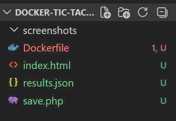
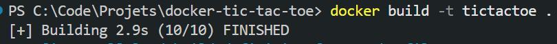
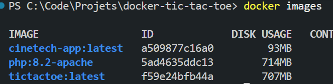
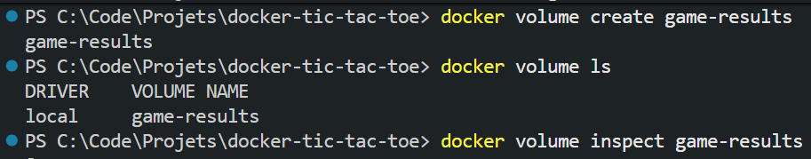
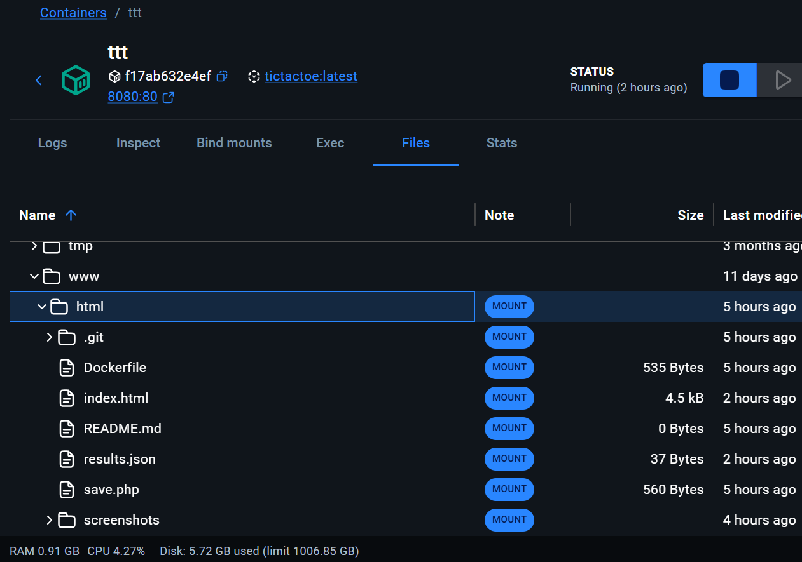
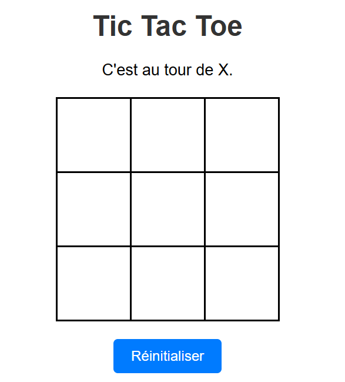
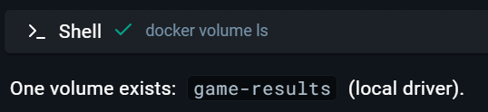

# Tic Tac Toe Docker

Petit projet Docker pour containeriser un jeu de morpion avec persistance des résultats via un volume (ou bind mount).

## 1. Arborescence du projet



Le dossier contient le Dockerfile, les fichiers du jeu (`index.html`, `save.php`, `results.json`) et le dossier `screenshots` contenant les captures du projet.

## 2. Le Dockerfile

```dockerfile
# Image de base : PHP 8.2 + Apache préconfigurés
FROM php:8.2-apache
# Copier la page du jeu dans le dossier servi par Apache
COPY index.html /var/www/html/
# Copier save.php et results.json au même endroit
COPY save.php /var/www/html/
COPY results.json /var/www/html/
# Apache tourne sous l'utilisateur www-data, qui doit pouvoir écrire dans results.json
RUN chown www-data:www-data /var/www/html/results.json
# Le conteneur écoute sur le port 80 en interne
EXPOSE 80
```

## 3. Construction de l'image

Commande utilisée :
```bash
docker build -t tictactoe .
```



## 4. Visualisation des images

Vérification de la bonne création de l'image :



## 5. Gestion du volume

Création du volume afin de sauvegarder les parties :
```bash
docker volume create game-results
```



## 6. Démarrage du conteneur et accès au jeu

On lance le conteneur en liant le port local 8080 au port 80 du conteneur, et en montant le volume (ex: `game-results:/var/www/html` ou `-v ${PWD}:/var/www/html` pour du bind mount local) :
```bash
docker run -d -p 8080:80 -v game-results:/var/www/html --name ttt tictactoe
```

On peut vérifier que le conteneur tourne bien avec l'interface Docker Desktop :



Aperçu du jeu en cours sur localhost:8080 :



## 7. Persistance des données

À chaque partie, les données (gagnant, nul) sont ajoutées au `results.json` stocké de manière persistante.



